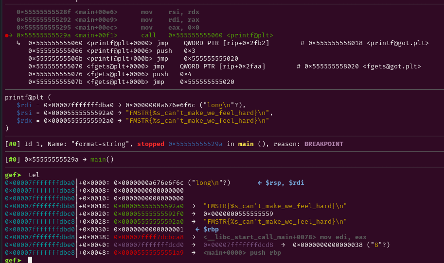
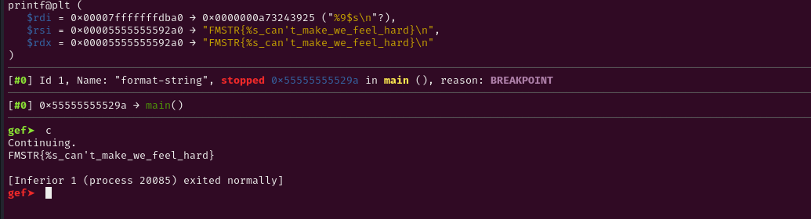

# Decriptiom

Lỗi định dạng với %s cũng khá giống với %p. Nhưng %s thay vì leak stack thì nó leak

nội dung mà stack đang trỏ tới.

# Code

```c
#include <stdio.h>
#include <stdlib.h>
#include <string.h>

int main() {
    FILE *fd;
    char *flag = malloc(64);
    if (!flag) {
        perror("malloc failed");
        return 1;
    }

    fd = fopen("flag.txt", "rt");
    if (fd == NULL) {
        perror("Error opening file");
        free(flag);
        return 1;
    }

    fgets(flag, 64, fd);
    fclose(fd);

    char *buf = flag;

    char fmstr[16];
    puts("Welcome Human!");
    puts("If you is a hacker, I have gift for u.");
    fgets(fmstr, sizeof(fmstr), stdin);
    printf(fmstr, buf);

    free(flag);
    return 0;
}

```

# Problem

Trong code có lỗi format-string. Ta cần gdb để xem chi tiết hơn.

# Solve

Đặt b* tại hàm gây lỗi.



Như ta thấy trên stack , flag được lưu trong heap.

Lúc này ta cần leak giá trị mà heap đang trỏ tới. Dùng %s.

Hãy tính offset với công thưc (target_address - rsp_address)/8+6 =9 

Vậy cần %9$s.




