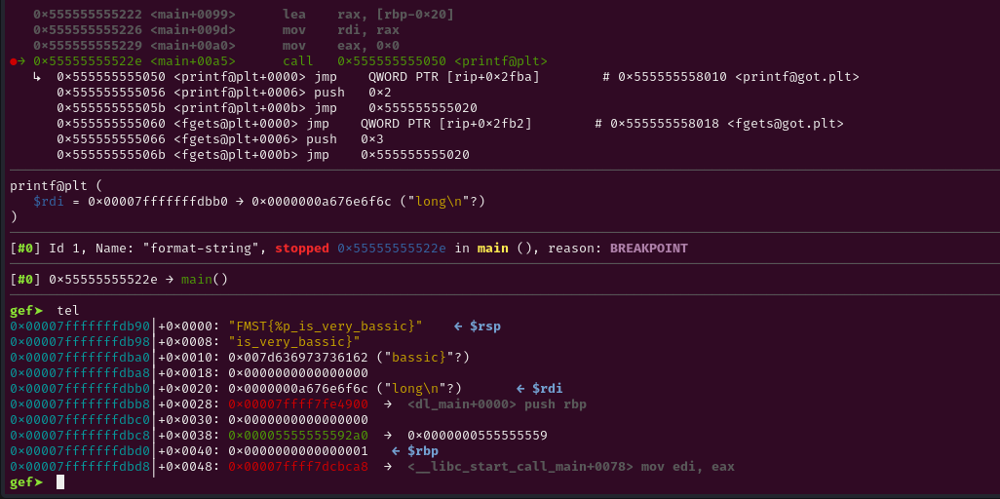
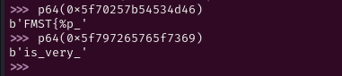

# Decription

Format-string %p là 1 lỗi định dạng chuỗi do lập trình không tốt.

NHư ta biết trong C hàm prinf() cần 2 tham số là định dạng chuỗi và con trỏ.

Lỗi fmst  xảy ra khi hàm printf bị thiếu  định dạng chuỗi.

# Code

```c
#include <stdio.h>

int main() {
    FILE *fd;
    char fmstr[16];
    char buf[24];
    fd = fopen("flag.txt", "rt");
    if (fd == NULL) {
        perror("Error opening file");
        return 1;
    }
    fgets(buf, sizeof(buf), fd);
    fclose(fd);

    puts("Welcome Human!");
    puts("If you is a hacker, I have gift for u.");
    fgets(fmstr, 32, stdin);
    printf(fmstr);
    return 0;
}

```

# Problem

Tôi đã viết 1 chương trình đơn giản có bug formatstring và bof. Nhưng trong bài này ta sẽ tập trung vào bof.

Ta thấy flag được lưu vào buf - 1 biến trên stack.

Và định dạng %p cho phép leak địa chỉ trên stack.

# Solve

Hãy dùng gdb để debug.

```c
gef➤  info b
Num     Type           Disp Enb Address            What
1       breakpoint     keep y   0x000055555555522e <main+165>
gef➤  

```

Những bài có lỗi format-string ta đặt b* tại hàm printf có lỗi.



Ta đang dừng ngay tại printf và ta thấy trên đầu stack đang là flag của chúng ta.

Ta tính padding từ đầu stack ngay tại printf đến stack target.

Thật may là nó ngay trên đầu stack trước khi print nên offset là (địa chỉ target - địa chỉ đầu stack) /8 + 6 = 6

Vậy ta chỉ cần nhập %6$p là leak được 8 bytes đầu tiên của flag rồi.

Ta chỉ cần nhập khi nhận được hêt flag là xong.




